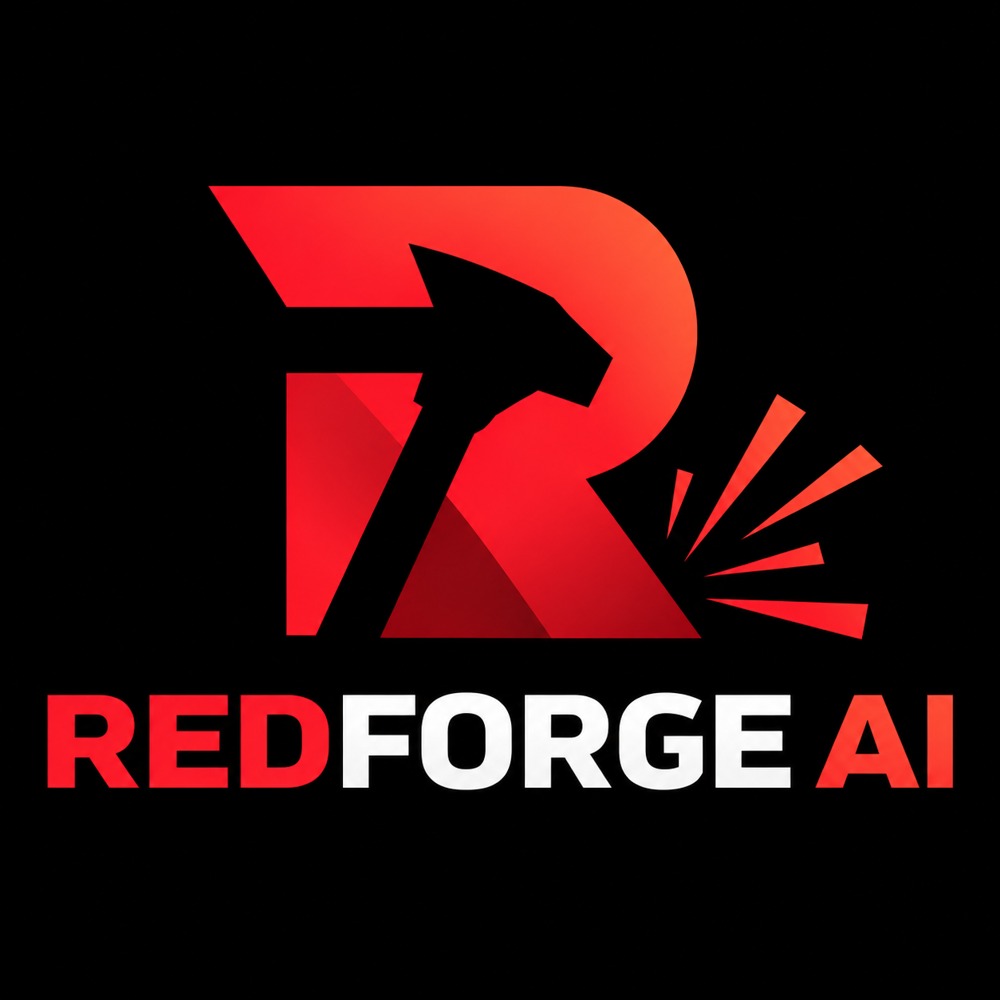
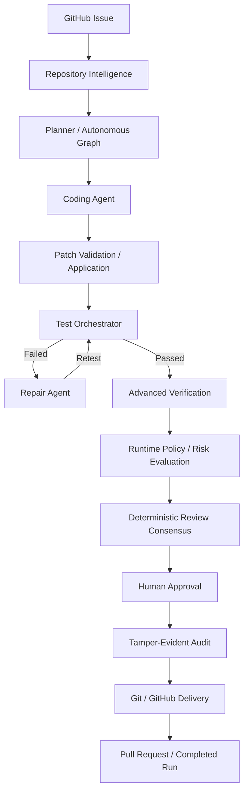

<p align="center">
  
</p>

# RedForge AI

**Agentic Software Engineering Platform with autonomous runtime integration, deep repository intelligence, specialized agents, engineering memory, evaluation, production policy, human approval, and audited GitHub delivery.**

> **Generation proposes. Verification decides.**

RedForge AI is designed around a controlled software-engineering workflow rather than unconstrained code generation.

**Issue → Repository Understanding → Plan → Code → Patch → Test → Repair → Advanced Verification → Runtime Policy → Risk Evaluation → Deterministic Review → Human Approval → Audit → GitHub Delivery**

## v1.6.0 - Autonomous Engineering Completion

RedForge AI v1.6.0 consolidates the complete autonomous engineering capability set into the active runtime. Real GitHub Issues can enter the system through signed webhooks or authenticated API calls, repository changes are analyzed down to dependency, symbol, and Python call relationships, autonomous work is checkpointed and memory-aware, and delivery remains blocked behind verification, policy, review, audit, and human-approval gates.

### What is implemented in v1.6.0

- Real GitHub Issue intake, signed webhook verification, replay protection, and label gating
- Authenticated Issue retrieval and Issue → RedForge run execution
- Controlled branch, commit, push, and pull-request delivery
- Multi-language dependency analysis plus Python symbol/call-graph evidence
- Direct/transitive impact analysis and targeted test suggestions
- Specialized planner, coder, repair, reviewer, and verifier roles
- Persistent engineering memory with prior-run recall
- Benchmark evaluation with TP/TN/FP/FN, precision, recall, accuracy, F1, and history
- Workspace boundaries, secret redaction, evidence integrity hashes, and fail-closed release gates
- ForgeGraph checkpoint/resume, Docker execution evidence, runtime policy, risk evaluation, deterministic review, human approval, and tamper-evident audit

## Core Capabilities

### Repository Intelligence

- Repository file, language, manifest, framework, and project-type discovery
- Git-state inspection
- Dependency inventory
- Python symbol indexing
- Repository-aware target selection for planning
- Repository-native test command detection
- Python import/dependency impact analysis for changed files

### Planning and Code Generation

- Deterministic issue planning
- Provider-independent LLM gateway
- OpenAI-compatible provider adapter
- Deterministic provider for tests
- Structured coding-agent contract
- Unified Git patch generation
- Patch validation and application through `git apply`

### Test → Repair → Retest

- Bounded automated repair loop
- Configurable maximum repair attempts
- Repair only after failed repository-native tests
- Minimal repair-patch workflow
- Retesting after every repair attempt
- Persisted repair evidence in `ForgeRun`

### Advanced Verification

The verification layer can combine:

- Ruff
- MyPy
- pytest
- coverage
- regression-baseline checks
- deterministic security checks
- optional Bandit
- optional Semgrep

High- and critical-severity blocking findings can prevent a run from being accepted.

### Runtime Policy and Execution Controls

- Workspace-bound command execution
- Command allow-list
- Sanitized subprocess environment
- Execution timeout controls
- Runtime principals
- Explicit permissions
- Egress allow-list policy
- Sensitive-path approval rules
- Policy decisions: `ALLOW`, `DENY`, or `REQUIRE_APPROVAL`

The runtime model follows the boundary:

**Identity → Permission → Action → Evidence → Verification → Approval → Audit**

### Graph-Based Orchestration

RedForge retains the `ForgeGraph` capability introduced earlier and v1.6.0 uses it as part of the integrated autonomy runtime:

- named workflow nodes
- conditional transitions
- bounded execution steps
- checkpoint persistence
- resume support
- execution state tracking

This provides a foundation for longer-running engineering workflows without making the LLM the source of truth.

### Checkpoint and Resume

`CheckpointStore` persists workflow state so an autonomous run can continue from a known checkpoint instead of restarting the complete workflow.

### Docker-Based Isolated Execution

The Docker execution layer introduced earlier remains part of the v1.6.0 runtime boundary with configurable controls such as:

- isolated container execution
- network disabled by default
- CPU and memory limits
- read-only container mode
- temporary writable filesystem
- execution timeout
- dry-run command generation

This is a stronger isolation option than application-level subprocess restrictions, but it should not be treated as a complete hostile-code security boundary without additional production hardening.

### Repository Impact Analysis

The Python impact analyzer uses AST-based import analysis to build repository relationships and estimate which Python modules may be affected by a change.

It is intentionally focused on Python import-level analysis and is not yet a full cross-language semantic call graph.

### LLM Routing and Fallback

The provider-independent LLM routing layer remains available for:

- multiple model/provider candidates
- provider priority
- fallback behavior
- provider failure budgets
- usage evidence
- cost-guard configuration

The core remains provider-independent.

### Engineering Memory

RedForge now includes SQLite-backed engineering memory for persistent workflow knowledge and evidence.

The memory layer supports storing and retrieving structured engineering records while keeping persistence separate from agent reasoning.

### GitHub Autonomy Planning

`GitHubAutonomyPlanner` provides structured planning for GitHub-driven autonomous work, including repository/workspace context, branch planning, and issue-derived execution envelopes.

Live GitHub automation still depends on explicit credentials, network access, repository configuration, and runtime authorization.

### Autonomous Engineering Platform

`AutonomousEngineeringPlatform` provides a unified stage-oriented facade around the autonomous workflow:

**Understand → Plan → Code → Patch → Test → Repair → Verify → Policy → Risk → Review → Approval → Audit → Delivery**

v1.6.0 uses `IntegratedAutonomyRuntime`, which connects the graph/checkpoint layer to the established `ForgeOrchestrator`, deep impact analysis, Docker execution evidence, release gating, and persistent engineering memory.

### Human Approval

Risk-sensitive operations can require explicit human approval before continuing, especially for sensitive repository paths and higher-impact actions.

### Tamper-Evident Audit

RedForge includes a SHA-256 hash-chained JSONL audit log with:

- sequence validation
- previous-hash validation
- event integrity checks
- tamper detection

### Reviewer Reliability

Reviewer quality can be tracked using:

- true positives
- true negatives
- false positives
- false negatives
- precision
- recall
- accuracy
- reliability scoring

### Deterministic Multi-Reviewer Verification

Independent deterministic reviewer roles combine verification, security, and risk/policy evidence through configurable consensus logic using:

- approval counts
- rejection counts
- confidence-weighted approval
- configurable minimum approvals
- a hard verification/policy veto that cannot be outvoted by a simple majority

These reviewer roles are deterministic verification components; they are not separate LLM agents.

### Git and GitHub Workflow

RedForge provides primitives for:

- branch creation
- repository status inspection
- committing changes
- remote branch push
- GitHub pull-request creation
- delivery authorization and audit evidence

### Observability and Concurrency

- Thread-safe runtime metrics
- counters and duration tracking
- concurrent job execution
- job status and result handling

### Unified Production Runtime

`ProductionRuntime` brings together:

- principals and permissions
- runtime policy
- authorization
- sandboxed command execution
- advanced verification
- audit logging
- runtime evidence
- metrics

## Architecture



**Generation proposes. Verification decides.**

The central v1.3 execution record remains `ForgeRun`, which captures the issue, repository context, plan, patches, test results, repair attempts, findings, verification results, policy decisions, risk assessment, review consensus, pending approval actions, runtime evidence, delivery readiness, approval state, and pull-request information.

v1.6.0 integrates the `roadmap_v200` capability layer around the established v1.4 foundation, including deep multi-language impact analysis, specialized agents, GitHub issue intake, benchmark evaluation, release gating, and an integrated autonomy runtime.

## Quick Start

### 1. Create and activate a virtual environment

```powershell
py -3.14 -m venv .venv
Set-ExecutionPolicy -Scope Process -ExecutionPolicy Bypass
.\.venv\Scripts\Activate.ps1
```

### 2. Install RedForge AI

```powershell
python -m pip install --upgrade pip
python -m pip install -e ".[dev]"
```

### 3. Run quality gates

```powershell
python -m ruff format .
python -m ruff check .
python -m pytest -q
python -m mypy backend\redforge
python scripts\validate_v160.py
git diff --check
```

### 4. Start the API

```powershell
python -m uvicorn redforge.main:app --app-dir backend --reload
```

## API

Health:

- `GET /health`
- `GET /ready`

Repository intelligence:

- `POST /api/v1/repository/scan`

Forge workflow:

- `POST /api/v1/forge/runs`
- `POST /api/v1/forge/runs/{run_id}/approve`
- `POST /api/v1/forge/runs/{run_id}/reject`
- `POST /api/v1/forge/runs/{run_id}/publish`

v1.6.0 registers the autonomy router in `redforge.main` and adds deep impact analysis plus authenticated GitHub issue retrieval alongside the existing autonomy endpoints.

## Configuration

### Automated Repair

```env
REDFORGE_REPAIR_ON_FAILURE=true
REDFORGE_MAX_REPAIR_ATTEMPTS=2
```

Example per-run overrides:

```json
{
  "generate_patch": true,
  "apply_patch": true,
  "repair_on_failure": true,
  "max_repair_attempts": 2
}
```

### LLM Provider

```env
REDFORGE_LLM_BASE_URL=http://localhost:11434/v1
REDFORGE_LLM_MODEL=qwen2.5-coder:7b
REDFORGE_LLM_API_KEY=
```

### Runtime / Verification

See `.env.example` for the current runtime settings, including end-to-end integration, production runtime, advanced verification, coverage threshold, allowed egress hosts, audit path, concurrency, reviewer approval configuration, and the human-approval risk threshold.

For real GitHub delivery, the runtime egress allow-list must permit the required GitHub hosts, such as `github.com` and `api.github.com`.

## Project Structure

```text
backend/redforge/
├── api/
│   └── autonomy.py
├── core/
├── execution/
├── integrations/
├── models/
├── production/
├── roadmap_v140/
├── roadmap_v200/
│   ├── agents.py
│   ├── evaluation.py
│   ├── github_live.py
│   ├── hardening.py
│   ├── intelligence.py
│   ├── models.py
│   ├── runtime.py
│   ├── service.py
│   └── webhook.py
├── verification/
└── main.py

tests/
├── production/
├── roadmap_v140/
└── roadmap_v200/

docs/
├── ROADMAP_V140_CONSOLIDATED.md
├── IMPLEMENTATION_V160.md
└── releases/
    ├── v1.5.0.md
    └── v1.6.0.md

scripts/
├── validate_v150.py
└── validate_v160.py
```

## Validation Status

RedForge AI v1.6.0 has been validated on the merged `main` branch with the complete project quality gates:

- Ruff: **PASS**
- MyPy: **PASS — 78 source files**
- pytest: **54 passed**
- `scripts/validate_v160.py`: **`ready: True`**
- `git diff --check`: **PASS**
- Working tree: **clean**

The official `v1.6.0` tag points to the validated merge commit:

`9cd3c2450c2ec2177e24f700543da5c7a84cc16d`

## Security and Isolation Note

RedForge has two relevant execution-control layers:

1. The production runtime provides application-level workspace restrictions, command authorization, environment sanitization, timeout controls, permissions, and policy enforcement.
2. The Docker-based isolation layer remains available and is surfaced as runtime evidence in the v1.6 autonomous runtime integration layer.

Docker isolation improves the execution boundary, but the current implementation should not be presented as a complete hostile-code or kernel-level security sandbox.

Fully untrusted workloads require additional production hardening and an appropriately secured container, virtual-machine, or operating-system isolation strategy.

## Implementation Status

The active package version is **1.6.0**. The internal `roadmap_v200` package name is retained as a historical implementation namespace; the capabilities in that package are integrated into the v1.6.0 runtime rather than being presented as separate future releases.

Live GitHub publication remains opt-in and requires explicit credentials, allowed network egress, repository permissions, and all RedForge release gates to pass.

## License

MIT
